## R Markdown

This is an R Markdown document. Markdown is a simple formatting syntax for authoring HTML, PDF, and MS Word documents. For more details on using R Markdown see <http://rmarkdown.rstudio.com>.

When you click the **Knit** button a document will be generated that includes both content as well as the output of any embedded R code chunks within the document. You can embed an R code chunk like this:


```r
library(tidyverse)
library(janitor)
library(here)
library(naniar)
```


```r
crosssec<-readr::read_csv("~/Desktop/BIS15W2021_rdean/Final Project Data/oasis_cross-sectional.csv")
```

```
## 
## ── Column specification ────────────────────────────────────────────────────────
## cols(
##   ID = col_character(),
##   `M/F` = col_character(),
##   Hand = col_character(),
##   Age = col_double(),
##   Educ = col_double(),
##   SES = col_double(),
##   MMSE = col_double(),
##   CDR = col_double(),
##   eTIV = col_double(),
##   nWBV = col_double(),
##   ASF = col_double(),
##   Delay = col_character()
## )
```

```r
longitudinal<-read_csv("~/Desktop/BIS15W2021_rdean/Final Project Data/oasis_longitudinal.csv")
```

```
## 
## ── Column specification ────────────────────────────────────────────────────────
## cols(
##   `Subject ID` = col_character(),
##   `MRI ID` = col_character(),
##   Group = col_character(),
##   Visit = col_double(),
##   `MR Delay` = col_double(),
##   `M/F` = col_character(),
##   Hand = col_character(),
##   Age = col_double(),
##   EDUC = col_double(),
##   SES = col_double(),
##   MMSE = col_double(),
##   CDR = col_double(),
##   eTIV = col_double(),
##   nWBV = col_double(),
##   ASF = col_double()
## )
```

```r
glimpse(crosssec)
```

```
## Rows: 436
## Columns: 12
## $ ID    <chr> "OAS1_0001_MR1", "OAS1_0002_MR1", "OAS1_0003_MR1", "OAS1_0004_MR…
## $ `M/F` <chr> "F", "F", "F", "M", "M", "F", "M", "F", "M", "F", "M", "F", "F",…
## $ Hand  <chr> "R", "R", "R", "R", "R", "R", "R", "R", "R", "R", "R", "R", "R",…
## $ Age   <dbl> 74, 55, 73, 28, 18, 24, 21, 20, 74, 52, 30, 81, 19, 76, 82, 21, …
## $ Educ  <dbl> 2, 4, 4, NA, NA, NA, NA, NA, 5, 3, NA, 5, NA, 2, 2, NA, 3, 5, 5,…
## $ SES   <dbl> 3, 1, 3, NA, NA, NA, NA, NA, 2, 2, NA, 2, NA, NA, 4, NA, 4, 1, 2…
## $ MMSE  <dbl> 29, 29, 27, NA, NA, NA, NA, NA, 30, 30, NA, 30, NA, 28, 27, NA, …
## $ CDR   <dbl> 0.0, 0.0, 0.5, NA, NA, NA, NA, NA, 0.0, 0.0, NA, 0.0, NA, 0.5, 0…
## $ eTIV  <dbl> 1344, 1147, 1454, 1588, 1737, 1131, 1516, 1505, 1636, 1321, 1574…
## $ nWBV  <dbl> 0.743, 0.810, 0.708, 0.803, 0.848, 0.862, 0.830, 0.843, 0.689, 0…
## $ ASF   <dbl> 1.306, 1.531, 1.207, 1.105, 1.010, 1.551, 1.157, 1.166, 1.073, 1…
## $ Delay <chr> "N/A", "N/A", "N/A", "N/A", "N/A", "N/A", "N/A", "N/A", "N/A", "…
```

```r
summary(crosssec)
```

```
##       ID                M/F                Hand                Age       
##  Length:436         Length:436         Length:436         Min.   :18.00  
##  Class :character   Class :character   Class :character   1st Qu.:23.00  
##  Mode  :character   Mode  :character   Mode  :character   Median :54.00  
##                                                           Mean   :51.36  
##                                                           3rd Qu.:74.00  
##                                                           Max.   :96.00  
##                                                                          
##       Educ            SES             MMSE            CDR        
##  Min.   :1.000   Min.   :1.000   Min.   :14.00   Min.   :0.0000  
##  1st Qu.:2.000   1st Qu.:2.000   1st Qu.:26.00   1st Qu.:0.0000  
##  Median :3.000   Median :2.000   Median :29.00   Median :0.0000  
##  Mean   :3.179   Mean   :2.491   Mean   :27.06   Mean   :0.2851  
##  3rd Qu.:4.000   3rd Qu.:3.000   3rd Qu.:30.00   3rd Qu.:0.5000  
##  Max.   :5.000   Max.   :5.000   Max.   :30.00   Max.   :2.0000  
##  NA's   :201     NA's   :220     NA's   :201     NA's   :201     
##       eTIV           nWBV             ASF           Delay          
##  Min.   :1123   Min.   :0.6440   Min.   :0.881   Length:436        
##  1st Qu.:1368   1st Qu.:0.7428   1st Qu.:1.112   Class :character  
##  Median :1476   Median :0.8090   Median :1.190   Mode  :character  
##  Mean   :1482   Mean   :0.7917   Mean   :1.199                     
##  3rd Qu.:1579   3rd Qu.:0.8420   3rd Qu.:1.284                     
##  Max.   :1992   Max.   :0.8930   Max.   :1.563                     
## 
```

```r
cross<-clean_names(crosssec)
cross
```

```
## # A tibble: 436 x 12
##    id          m_f   hand    age  educ   ses  mmse   cdr e_tiv n_wbv   asf delay
##    <chr>       <chr> <chr> <dbl> <dbl> <dbl> <dbl> <dbl> <dbl> <dbl> <dbl> <chr>
##  1 OAS1_0001_… F     R        74     2     3    29   0    1344 0.743  1.31 N/A  
##  2 OAS1_0002_… F     R        55     4     1    29   0    1147 0.81   1.53 N/A  
##  3 OAS1_0003_… F     R        73     4     3    27   0.5  1454 0.708  1.21 N/A  
##  4 OAS1_0004_… M     R        28    NA    NA    NA  NA    1588 0.803  1.10 N/A  
##  5 OAS1_0005_… M     R        18    NA    NA    NA  NA    1737 0.848  1.01 N/A  
##  6 OAS1_0006_… F     R        24    NA    NA    NA  NA    1131 0.862  1.55 N/A  
##  7 OAS1_0007_… M     R        21    NA    NA    NA  NA    1516 0.83   1.16 N/A  
##  8 OAS1_0009_… F     R        20    NA    NA    NA  NA    1505 0.843  1.17 N/A  
##  9 OAS1_0010_… M     R        74     5     2    30   0    1636 0.689  1.07 N/A  
## 10 OAS1_0011_… F     R        52     3     2    30   0    1321 0.827  1.33 N/A  
## # … with 426 more rows
```

```r
longitudinal<-clean_names(longitudinal)
summary(longitudinal)
```

```
##   subject_id           mri_id             group               visit      
##  Length:373         Length:373         Length:373         Min.   :1.000  
##  Class :character   Class :character   Class :character   1st Qu.:1.000  
##  Mode  :character   Mode  :character   Mode  :character   Median :2.000  
##                                                           Mean   :1.882  
##                                                           3rd Qu.:2.000  
##                                                           Max.   :5.000  
##                                                                          
##     mr_delay          m_f                hand                age       
##  Min.   :   0.0   Length:373         Length:373         Min.   :60.00  
##  1st Qu.:   0.0   Class :character   Class :character   1st Qu.:71.00  
##  Median : 552.0   Mode  :character   Mode  :character   Median :77.00  
##  Mean   : 595.1                                         Mean   :77.01  
##  3rd Qu.: 873.0                                         3rd Qu.:82.00  
##  Max.   :2639.0                                         Max.   :98.00  
##                                                                        
##       educ           ses            mmse            cdr             e_tiv     
##  Min.   : 6.0   Min.   :1.00   Min.   : 4.00   Min.   :0.0000   Min.   :1106  
##  1st Qu.:12.0   1st Qu.:2.00   1st Qu.:27.00   1st Qu.:0.0000   1st Qu.:1357  
##  Median :15.0   Median :2.00   Median :29.00   Median :0.0000   Median :1470  
##  Mean   :14.6   Mean   :2.46   Mean   :27.34   Mean   :0.2909   Mean   :1488  
##  3rd Qu.:16.0   3rd Qu.:3.00   3rd Qu.:30.00   3rd Qu.:0.5000   3rd Qu.:1597  
##  Max.   :23.0   Max.   :5.00   Max.   :30.00   Max.   :2.0000   Max.   :2004  
##                 NA's   :19     NA's   :2                                      
##      n_wbv             asf       
##  Min.   :0.6440   Min.   :0.876  
##  1st Qu.:0.7000   1st Qu.:1.099  
##  Median :0.7290   Median :1.194  
##  Mean   :0.7296   Mean   :1.195  
##  3rd Qu.:0.7560   3rd Qu.:1.293  
##  Max.   :0.8370   Max.   :1.587  
## 
```

```r
longitudinal %>% 
  count(group)
```

```
## # A tibble: 3 x 2
##   group           n
## * <chr>       <int>
## 1 Converted      37
## 2 Demented      146
## 3 Nondemented   190
```

```r
cross %>% ##comparison of n_wbv between demented patients and age matched controls
  filter(age>60) %>% 
  group_by(cdr) %>% 
  ggplot(aes(x=cdr,y=n_wbv,group=cdr))+
  geom_boxplot()
```

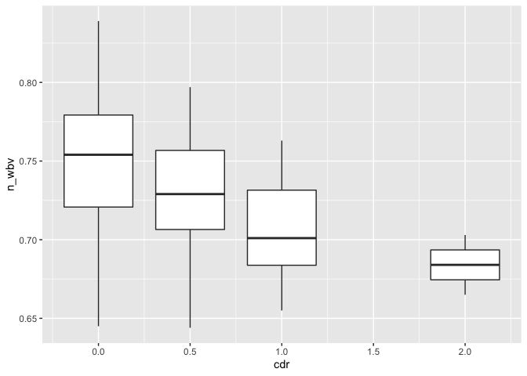<!-- -->

```r
cross %>% #comparing n_wbv between demented groups
  filter(cdr>0) %>% 
  group_by(cdr) %>% 
  ggplot(aes(x=cdr,y=n_wbv,group=cdr))+
  geom_boxplot()
```

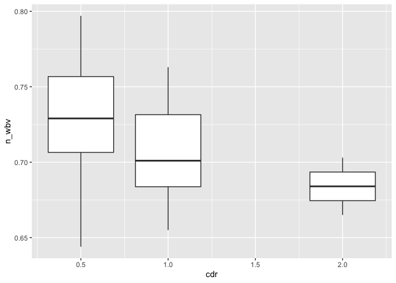<!-- -->

```r
cross %>% #Range of n_wbv of all demented participants vs control age matched controls
  mutate(demented=cdr>0) %>%
  filter(demented!="NA",age>60) %>% 
  group_by(demented) %>% 
  ggplot(aes(x=demented, y=n_wbv))+
  geom_boxplot()
```

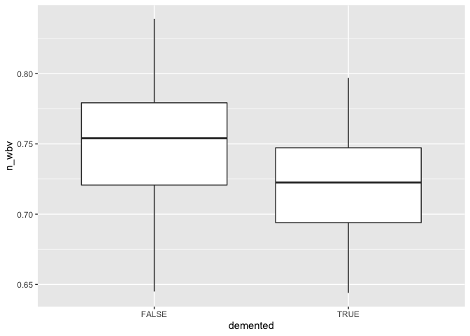<!-- -->

```r
longitudinal %>% #Comparison of education between demented participants and age matched controls
  filter(age>60,group!="Converted") %>% 
  group_by(group) %>% 
  ggplot(aes(x=group,y=educ))+
  geom_boxplot()
```

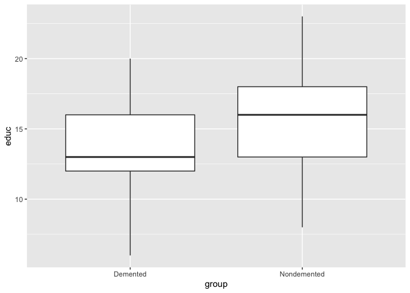<!-- -->

```r
longitudinal %>% #Comparison of ses between demented participants and age matched controls
  filter(age>60,group!="Converted",ses!="NA") %>% 
  group_by(group) %>% 
  ggplot(aes(x=group,y=ses))+
  geom_boxplot()
```

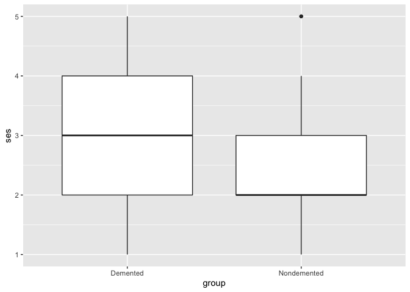<!-- -->

```r
cross %>% #Incidence of males vs females with dementia
  filter(age>60) %>% 
  mutate(demented=cdr>0) %>% 
  group_by(demented) %>% 
  ggplot(aes(x=demented, fill=m_f))+
  geom_bar()
```

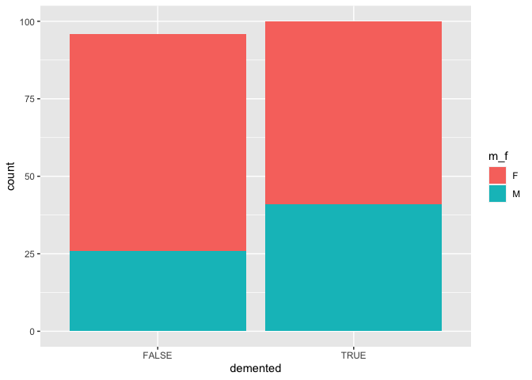<!-- -->

```r
cross %>% #Comparison of MMSE and CDR
  mutate(cdr = as.factor(cdr)) %>%
  ggplot(aes(cdr, mmse, fill = cdr))+
  geom_boxplot(alpha = 0.7) +
  geom_jitter(aes(color = cdr),alpha = 0.6)+
  xlab("Clinical Dementia Rating (CDR)") +
  ylab("Mini-Mental State Examination")
```

```
## Warning: Removed 201 rows containing non-finite values (stat_boxplot).
```

```
## Warning: Removed 201 rows containing missing values (geom_point).
```

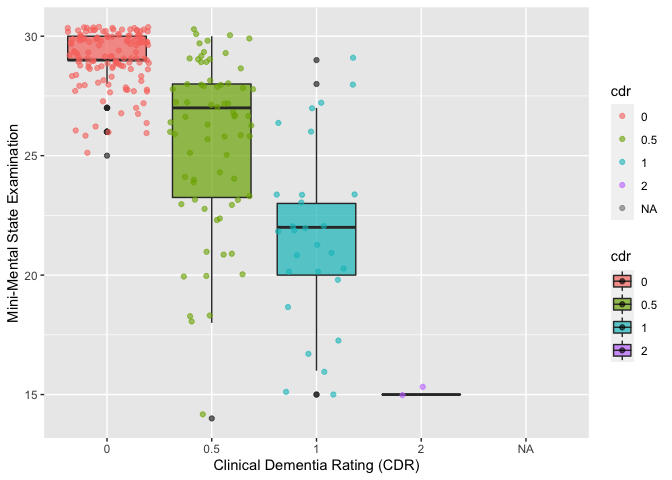<!-- -->

```r
cross %>% #violin comparison of CDR and age
  filter(cdr!="NA", age>60) %>% 
  ggplot(aes(x = as.factor(cdr), y = age)) + 
  geom_violin(aes(fill = as.factor(cdr))) + 
  geom_boxplot(width = 0.2)+
  labs(x="Clinical Dementia Rating",y="Age Distribution ",title="CDR Distribution")
```

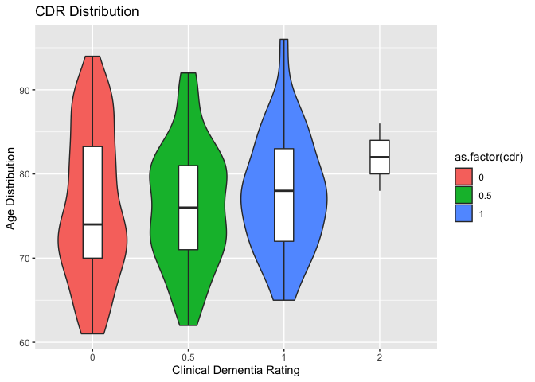<!-- -->

```r
cross %>% #Number of demented participants within each ses subgroup
  filter(cdr>0) %>% 
  ggplot(aes(x=ses, group=ses))+ 
  geom_bar()
```

```
## Warning: Removed 17 rows containing non-finite values (stat_count).
```

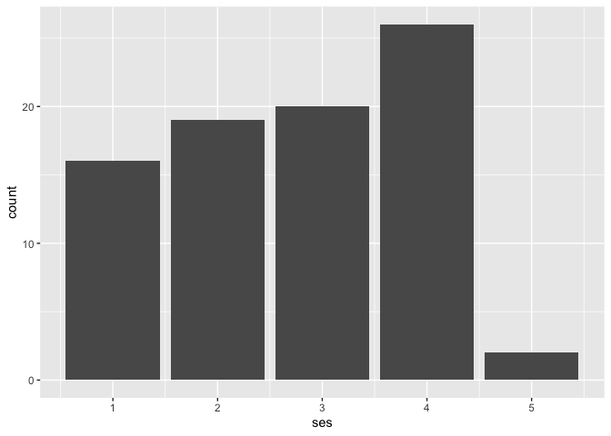<!-- -->

```r
longitudinal %>% #Observing the change between visits in n_wbv of the converted group
  filter(group=="Converted") %>% 
  ggplot(aes(x=visit,y=n_wbv,color=subject_id))+ 
  geom_point()+
  geom_line()
```

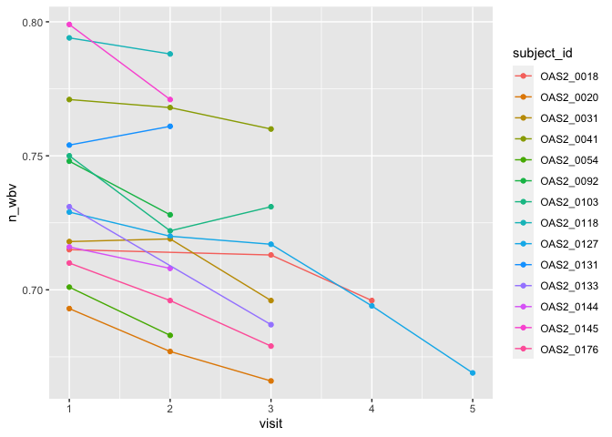<!-- -->

```r
longitudinal %>% #Observing the change between visits in n_wbv of the converted group
  filter(group=="Demented") %>% 
  ggplot(aes(x=visit,y=n_wbv,color=subject_id))+ 
  geom_point()+
  geom_line()+
  theme(legend.position = "none")
```

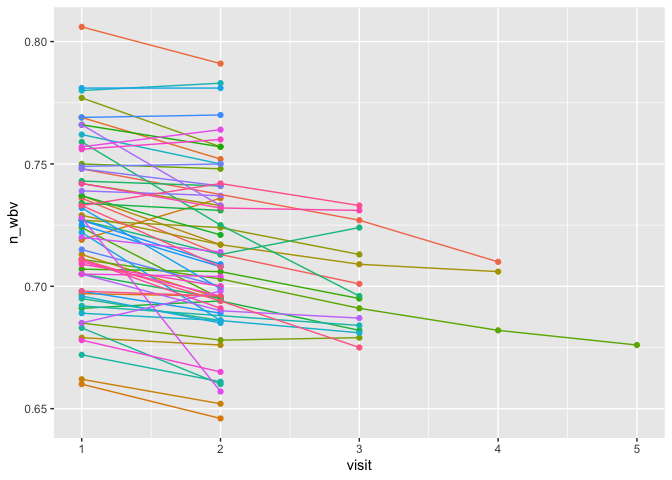<!-- -->

```r
longitudinal %>% #Observing the change between visits in n_wbv of the converted group
  filter(group=="Nondemented") %>% 
  ggplot(aes(x=visit,y=n_wbv,color=subject_id))+ 
  geom_point()+
  geom_line()+
  theme(legend.position = "none")
```

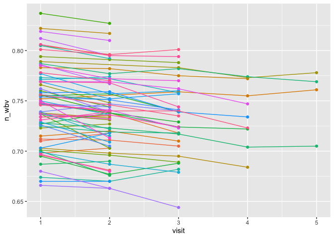<!-- -->


